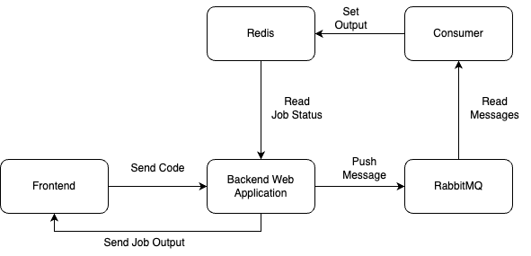

# Remote Code Execution Platform

I was always fasinated by the idea of having a platform where you can run code remotely on the list of test cases & get the output. This is a simple implementation of that idea.

There are some great implmentations on Github for running code in different programming languages but no one explains how to run code remotely on the list of test cases. So I decided to build one myself.

(Blog)[https://medium.com/towardsdev/i-have-built-a-remote-code-execution-engine-like-leetcode-here-are-my-learnings-5e57d92a5602]

## Features

- Run code remotely on the list of test cases. (Currently only supporting JS. Will add more languages soon & also JS is the best language in the world :P)
- Get the output of the code.
- Get whether the code passed all the test cases or not.

## How to use

I have built this project as web application & it is hoted on [link](http://139.59.193.150:3000/). Thanks to [Digital Ocean](https://www.digitalocean.com/).

## Architecture



## How to run locally

- Clone the repo

- Run Frontend

  ```
  $ cd frontend
  $ npm install
  $ npm run dev
  ```

- Run redis inside docker

  ```
  $ docker run --name my-redis -p 6379:6379 redis
  ```

- Run rabbitmq inside docker

  ```
  $ docker run --rm -it -p 15672:15672 -p 5672:5672 rabbitmq:3-management
  ```

- Create folder `codeFiles` inside `backend` folder.

- Run Backend

  ```
  $ cd backend
  $ npm install
  $ npm run dev
  ```

- Run Consumer

  ```
  $ npx ts-node src/consumer.ts
  ```
